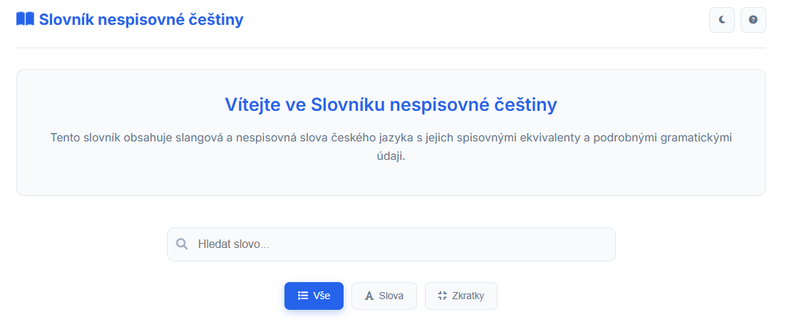

# Czech Slang Dictionary

[](https://opensource.org/licenses/MIT)
[](https://nodejs.org/)
[](https://www.sqlite.org/)
[](https://czech-slang-dictionary.onrender.com/)

> *Slovník nespisovné češtiny* - An interactive web application for exploring colloquial and slang expressions in the Czech language.


## ✨ Features

- **Intelligent Search**: Fuzzy search with diacritic-insensitive matching
- **Smart Filtering**: Filter by words, abbreviations, or view all
- **Detailed Definitions**: Complete grammatical information in SSJČ style
- **Dark/Light Theme**: Toggle between themes for comfortable reading
- **Responsive Design**: Works perfectly on desktop and mobile devices
- **Fast Performance**: SQLite database with optimized queries
- **Auto-suggestions**: Real-time search suggestions as you type

## 🚀 How It Works

This application consists of two main components:

### Frontend
- **Technologies**: HTML5, CSS3, Vanilla JavaScript
- **Features**: Modern UI with smooth animations, theme switching, modal dialogs
- **Search Engine**: Client-side fuzzy matching with server-side API calls

### Backend
- **Technologies**: Node.js, Express.js, SQLite3
- **API Endpoints**: RESTful API for word retrieval and search
- **Database**: SQLite database seeded with Czech slang words and their definitions

### Architecture
```
┌─────────────────┐    HTTP Requests    ┌─────────────────┐
│   Frontend      │◄──────────────────►│   Backend       │
│   (HTML/CSS/JS) │                     │   (Node.js)     │
└─────────────────┘                     └─────────────────┘
                                              │
                                              ▼
                                       ┌─────────────────┐
                                       │   Database      │
                                       │   (SQLite)      │
                                       └─────────────────┘
```

## 🛠️ Installation & Setup

### Prerequisites
- Node.js 18+
- npm or yarn

### Quick Start
```bash
# Clone the repository
git clone https://github.com/WrackerTony/Czech_slang_dictionary.git
cd Czech_slang_dictionary

# Install dependencies
npm run setup

# Seed the database with initial data
npm run seed

# Start the development server
npm run dev
```

The application will be available at:
- Frontend: http://localhost:3001
- Backend API: http://localhost:3000

### Manual Setup
```bash
# Install root dependencies
npm install

# Install backend dependencies
cd backend
npm install

# Seed the database
node seed.js

# Start backend (in one terminal)
npm run dev

# Start frontend (in another terminal)
cd ../frontend
npx http-server -p 3001 -o
```

## 🌐 Live Demo

Experience the Czech Slang Dictionary live at: [**https://czech-slang-dictionary.onrender.com/**](https://czech-slang-dictionary.onrender.com/)

## 📊 Database Schema

The SQLite database contains the following main tables:
- `words`: Core slang words with definitions
- `extended_words`: Additional word variations and forms

## 🤝 Contributing


### Contributors
- **Antonín Kuneš** - Main developer


## 📄 License

This project is licensed under the MIT License - see the [LICENSE](LICENSE) file for details.

## 🎨 UI/UX Highlights

- **Smooth Animations**: CSS transitions and transforms for fluid interactions
- **Modern Design**: Clean, card-based layout with Font Awesome icons
- **Accessibility**: ARIA labels and keyboard navigation support
- **Performance**: Lazy loading and optimized rendering

---

*Made with ❤️ for Czech language enthusiasts*